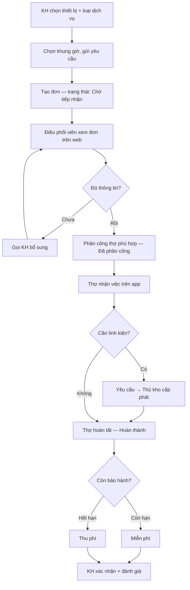

# BUỔI 3 — WORKSHOP THỰC HÀNH
## Quy trình Phân tích & Thiết kế — Đề tài: Hệ thống Bảo hành – Bảo dưỡng điện tử điện lạnh ABC

> **Cách dùng tài liệu này:** Giảng viên chiếu bản này làm **mẫu chuẩn** để học viên đối chiếu sau khi tự làm. Suốt buổi, mọi bài tập xoay quanh **một đề tài duy nhất** để học viên đi gần trọn một vòng phân tích thực tế.

---

## 📋 ĐỀ BÀI (phát cho học viên đầu buổi)

> **Trung tâm Bảo hành – Bảo dưỡng điện tử điện lạnh ABC** muốn số hoá quy trình. Cần 2 sản phẩm:
> - **App mobile cho Khách hàng:** đặt lịch bảo hành/bảo dưỡng, theo dõi tiến độ, quản lý thiết bị.
> - **Web hệ thống cho Trung tâm:** tiếp nhận đơn, điều phối thợ, quản lý **kho linh kiện** và cấp phát linh kiện cho thợ đi sửa.
>
> *Bạn là BA của dự án. Hôm nay bạn sẽ lần lượt: (1) lập Function List, (2) lập Master Plan chia sprint, (3) lập bảng quản lý Stakeholder, (4) dùng AI thiết kế các luồng chính.*

**4 bài thực hành:**

| BT | Nội dung | Sản phẩm |
|:--:|---|---|
| 1 | Tìm hiểu domain → **Function List** 2 phân hệ | Bảng chức năng |
| 2 | **Master Plan** + chia Sprint (Hybrid) | Lộ trình sprint |
| 3 | **Stakeholder Register** (bảng quản lý bên liên quan) | Bảng + ma trận |
| 4 | Dùng **AI thiết kế luồng chính** | Sơ đồ Mermaid |

---

# 1️⃣ FUNCTION LIST — 2 phân hệ

> **Yêu cầu:** Nhóm chức năng **theo nghiệp vụ**, không liệt kê lộn xộn. Mỗi phân hệ 8–10 nhóm chức năng.

## 📱 App Khách hàng (mobile)

| # | Nhóm chức năng | Mô tả |
|:--:|---|---|
| 1 | Đăng nhập & Hồ sơ | Đăng ký, đăng nhập, quản lý thông tin cá nhân |
| 2 | **Quản lý thiết bị của tôi** | Thêm thiết bị, xem hạn bảo hành, lịch sử dịch vụ theo thiết bị |
| 3 | **Đặt lịch bảo hành/bảo dưỡng** | Chọn thiết bị + loại dịch vụ + khung giờ + địa chỉ |
| 4 | **Theo dõi trạng thái đơn** | Timeline: chờ tiếp nhận → đã phân thợ → đang sửa → hoàn thành |
| 5 | Thông báo | Nhận thông báo đẩy cập nhật đơn |
| 6 | **Đánh giá & phản hồi** | Chấm điểm, góp ý sau dịch vụ; gửi khiếu nại |
| 7 | Kênh hỗ trợ | Chat / hotline / FAQ |
| 8 | Lịch sử dịch vụ | Xem lại các đơn đã thực hiện |

## 💻 Web quản trị (Trung tâm)

| # | Nhóm chức năng | Mô tả |
|:--:|---|---|
| 1 | Quản lý người dùng & phân quyền | Tài khoản, vai trò (admin, điều phối, thợ, thủ kho, kế toán) |
| 2 | **Danh mục dùng chung** | Loại thiết bị, loại dịch vụ, linh kiện, khu vực, chính sách bảo hành |
| 3 | **Tiếp nhận đơn** | Nhận đơn từ app + tổng đài nhập tay |
| 4 | **Điều phối & phân công thợ** | Phân thợ theo khu vực / kỹ năng / lịch trống |
| 5 | Quản lý thực hiện | Cập nhật trạng thái, biên bản sửa chữa |
| 6 | **Quản lý kho & cấp phát linh kiện** | Tồn kho, nhập/xuất, cấp phát cho thợ theo đơn |
| 7 | Chính sách bảo hành & tính phí | Kiểm tra điều kiện bảo hành, tính phí (miễn phí/thu phí) |
| 8 | Quản lý thợ | Hồ sơ, kỹ năng, lịch, năng suất |
| 9 | **Báo cáo & Dashboard** | SLA, năng suất thợ, tồn kho, doanh thu, tỷ lệ bảo hành |

---

# 2️⃣ MASTER PLAN & CHIA SPRINT

## 🧭 Cách tiếp cận: Hybrid (Waterfall front + Agile delivery)

```
[ Giai đoạn 1: PHÂN TÍCH THIẾT KẾ TỔNG THỂ ]  →  [ Giai đoạn 2: PHÁT TRIỂN THEO SPRINT ]
   (làm trọn gói, có bức tranh lớn)                (giao tăng dần, mỗi sprint dùng được)
```

**Giai đoạn 1 — Khảo sát & Phân tích thiết kế (làm trước, trọn gói):**
Khảo sát domain → Function list 2 phân hệ → Quy trình nghiệp vụ (các luồng chính) → ERD sơ bộ → Kiến trúc & wireframe chính → **Backlog đã chia sprint**.
→ *Đây là phần "Waterfall" của Hybrid: có đích đến rõ trước khi code.*

**Giai đoạn 2 — Phát triển theo sprint (giao tăng dần):**
Mỗi sprint ~2 tuần, **cộng dồn** chức năng lên nền sprint trước.

## 📌 4 nguyên tắc chia sprint

1. **Phân tích thiết kế tổng thể TRƯỚC**, rồi mới chia sprint dev (đặc trưng Hybrid).
2. **Mỗi sprint kết thúc = một mảng chức năng DÙNG ĐƯỢC + TEST ĐƯỢC** — người test có thể là **admin/nội bộ trước**, chưa cần là khách hàng cuối.
3. **Cộng dồn, không đập đi làm lại** — sprint sau xây thêm lên nền sprint trước.
4. **Cuối mỗi sprint có demo + nghiệm thu → lấy feedback** → còn sửa thì sửa nhỏ trong sprint kế.

## 🗂️ Lộ trình 8 Sprint

| Sprint | Tên sprint | Chức năng chính | Cuối sprint DÙNG & TEST được? | Phân hệ |
|:--:|---|---|---|:--:|
| **1** | Nền tảng: người dùng & danh mục | Đăng nhập, quản lý user, **vai trò & phân quyền**, danh mục dùng chung (loại thiết bị/dịch vụ/linh kiện/khu vực) | **Admin:** tạo user, phân quyền, cấu hình danh mục → demo & test được | Web QT |
| **2** | Tiếp nhận đơn & phân công thợ | Tạo/tiếp nhận đơn (tổng đài nhập tay), danh sách đơn, **phân công thợ** (khu vực/kỹ năng/lịch) | **Điều phối viên:** nhập đơn, phân thợ | Web QT |
| **3** | Thực hiện & cập nhật trạng thái | App thợ nhận việc, cập nhật trạng thái (đang đi → đang sửa → hoàn thành), biên bản; *kiểm tra bảo hành & tính phí* | **Thợ:** nhận & cập nhật đơn trên app | App thợ + Web |
| **4** | Quản lý kho & cấp phát linh kiện | Tồn kho, nhập/xuất, thợ yêu cầu linh kiện, **thủ kho cấp phát**, gắn linh kiện vào đơn | **Thủ kho + Thợ:** cấp & nhận linh kiện | Web + App thợ |
| **5** | App KH: đặt lịch & theo dõi đơn | KH đăng ký, **đặt lịch** (thiết bị/loại DV/khung giờ), theo dõi trạng thái, thông báo đẩy | **Khách hàng:** tự đặt lịch → đơn chảy vào luồng điều phối đã có ⇒ *luồng end-to-end đầy đủ* | App KH |
| **6** | KH phản hồi & kênh hỗ trợ | Đánh giá sau dịch vụ, phản hồi/khiếu nại, chat/hotline hỗ trợ | **Khách hàng:** đánh giá & liên hệ hỗ trợ | App KH + Web |
| **7** | KH quản lý thiết bị của mình | Thêm/quản lý thiết bị, xem hạn bảo hành, lịch sử dịch vụ theo thiết bị | **Khách hàng:** quản lý thiết bị, xem hạn BH | App KH |
| **8** | Báo cáo & dashboard | Báo cáo SLA, năng suất thợ, tồn kho, doanh thu, tỷ lệ bảo hành | **Quản lý:** xem số liệu ra quyết định | Web QT |

## 🔗 Vì sao thứ tự này? (logic phụ thuộc — đừng chia bừa)

- **Sprint 1 trước tiên** vì *mọi* chức năng sau đều cần user + phân quyền + danh mục dùng chung.
- **Sprint 2–3 (điều phối → thực hiện)** dựng xong **xương sống nghiệp vụ** để nội bộ test được trước.
- **Sprint 4 (kho)** gắn vào sau khi đã có luồng thực hiện của thợ.
- **Sprint 5 (app KH)** ráp vào cuối phần lõi → lúc này luồng **KH → điều phối → thợ → kho → hoàn tất** chạy trọn vẹn.
- **Sprint 6–7** là trải nghiệm KH nâng cao (feedback, thiết bị) — làm sau khi luồng chính ổn.
- **Sprint 8 (báo cáo)** để cuối vì cần **dữ liệu thật** tích luỹ từ các sprint trước.

## ⚠️ Lằn ranh phải giữ

Mỗi sprint phải có **màn hình bấm được + test được + lấy feedback được** — dù chỉ admin test. Nếu cuối sprint *chẳng ai xem được gì* (chỉ code hạ tầng ẩn) → đã tụt về **Waterfall trá hình**.

*Trade-off cần biết: app KH ở Sprint 5 nên rủi ro trải nghiệm khách được kiểm chứng hơi muộn. Chấp nhận được vì đã có bức tranh tổng thể từ Giai đoạn 1.*

---

# 3️⃣ STAKEHOLDER REGISTER (Bảng quản lý bên liên quan)

> **Phân biệt 2 công cụ:**
> - **Ma trận Power × Interest** = hình 2×2 để **định vị** nhanh.
> - **Stakeholder Register (bảng dưới)** = bảng chi tiết để **quản lý** — có thêm chiến lược tiếp cận & kênh liên lạc.

## Bảng Register (mẫu chuẩn)

| # | Stakeholder | Vai trò trong dự án | Mối quan tâm chính | Power | Interest | Nhóm (P×I) | Chiến lược tiếp cận | Kênh & tần suất |
|:--:|---|---|---|:--:|:--:|---|---|---|
| 1 | **Giám đốc Trung tâm ABC** | Chủ đầu tư + vận hành | ROI, giảm chi phí điều phối | Cao | Cao | Quản lý sát | Đồng quyết định, demo mỗi sprint | Họp 2 tuần/lần |
| 2 | **Trưởng phòng Điều phối** | Chủ quy trình, user chính web | Điều phối nhanh, bớt gọi điện | Cao | Cao | Quản lý sát | Đồng thiết kế quy trình | Hằng tuần |
| 3 | CEO / Chủ DN | Duyệt ngân sách | Chi phí, rủi ro, hình ảnh | Cao | Thấp | Làm hài lòng | Báo cáo tóm tắt theo cột mốc | Theo milestone |
| 4 | Kế toán trưởng | Chính sách thu phí/bảo hành | Tính phí đúng, công nợ | Cao | Thấp | Làm hài lòng | Chốt rule tính phí | Khi liên quan |
| 5 | **Thợ kỹ thuật** | User app thợ | App dễ dùng, việc rõ ràng | Thấp | Cao | Cập nhật thường xuyên | Phỏng vấn + cho thử app sớm | Mỗi sprint demo |
| 6 | **Thủ kho** | User chức năng kho | Cấp phát nhanh, tồn kho đúng | Thấp | Cao | Cập nhật thường xuyên | Phỏng vấn quy trình kho | Sprint kho |
| 7 | Tổng đài / CSKH | Tiếp nhận đơn | Nhập liệu nhanh, ít lỗi | Thấp | Cao | Cập nhật thường xuyên | Lấy pain point đầu dự án | Đầu dự án |
| 8 | **Khách hàng** | User app KH | Đặt lịch dễ, theo dõi minh bạch | Thấp | Cao | Cập nhật thường xuyên | Khảo sát + UAT | Đầu + UAT |
| 9 | Phòng IT hạ tầng | Vận hành, bảo mật | Uptime, an toàn dữ liệu | TB | Thấp | Làm hài lòng | Chốt yêu cầu phi chức năng | Đầu + trước go-live |
| 10 | NCC linh kiện ngoài | Cung ứng linh kiện | Đơn đặt hàng rõ | Thấp | Thấp | Theo dõi | Thông báo khi liên quan | Khi cần |

## Ma trận Power × Interest (định vị trực quan)

| | **Interest THẤP** | **Interest CAO** |
|---|---|---|
| **Power CAO** | *Làm hài lòng:* CEO/Chủ DN · Kế toán trưởng | *Quản lý sát:* **Giám đốc Trung tâm** · **Trưởng phòng Điều phối** |
| **Power THẤP** | *Theo dõi:* Phòng NS · NCC linh kiện ngoài | *Cập nhật thường xuyên:* **Thợ** · **Thủ kho** · Tổng đài · **Khách hàng** |

> 💡 **Điểm dạy:** Người dùng chính (thợ, thủ kho, KH) thường **Power thấp nhưng Interest cao** — BA phải chủ động lấy ý kiến họ dù họ không "quyết". Cột "Nhóm" và "Chiến lược tiếp cận" **phải khớp nhau**.

---

# 4️⃣ DÙNG AI THIẾT KẾ LUỒNG CHÍNH

> Học viên dùng **Claude / ChatGPT** sinh sơ đồ **Mermaid**, dán vào **VS Code** (plugin Mermaid) để xem. Sau đó **phản biện** sơ đồ AI vẽ.

## 7 luồng chính (⭐ = làm tại lớp)

1. ⭐ **Đặt lịch bảo hành/bảo dưỡng** (KH – app)
2. ⭐ **Tiếp nhận & điều phối đơn, phân công thợ** (web)
3. ⭐ **Thợ thực hiện & cập nhật trạng thái** (app thợ)
4. **Yêu cầu & cấp phát linh kiện từ kho**
5. **Kiểm tra điều kiện bảo hành → miễn phí / thu phí**
6. **KH theo dõi + đánh giá sau dịch vụ**
7. **Đăng ký & quản lý thiết bị của KH**

## Prompt mẫu (chiếu cho học viên copy)

```
Tôi là BA dự án "Hệ thống bảo hành – bảo dưỡng điện tử điện lạnh ABC".
Vẽ sơ đồ luồng cho quy trình: "KH đặt lịch bảo dưỡng qua app → đến khi hoàn tất".
Yêu cầu:
- Xuất cú pháp Mermaid (flowchart TD) để tôi dán vào VS Code.
- Actor: Khách hàng, Điều phối viên, Thợ kỹ thuật, Thủ kho.
- Có nhánh rẽ: cần linh kiện hay không; còn bảo hành hay hết hạn.
- Ghi rõ trạng thái đơn ở mỗi bước. Tiếng Việt.
```

## Sơ đồ mẫu "chuẩn" (đối chiếu với bài của học viên)



## ⚠️ Điểm dạy quan trọng — Phản biện sơ đồ AI

AI thường chỉ vẽ **happy path**. BA giỏi là người bổ sung **các nhánh ngoại lệ**:
- KH **huỷ đơn** giữa chừng?
- Thợ báo **không sửa được** / cần chuyển xưởng?
- **Hết linh kiện** trong kho?
- KH **vắng nhà** khi thợ đến?
- KH **không đồng ý mức phí** sau khi báo giá?

→ *Bài học: dùng AI để dựng nhanh khung, nhưng giá trị của BA nằm ở việc bổ sung các trường hợp AI bỏ sót.*

---

## ⏱️ Gợi ý tổ chức thời gian (150 phút)

| Thời gian | Hoạt động |
|---|---|
| Đầu buổi | Phát đề bài, chia 3 nhóm |
| BT1 – BT2 | Function list + Master Plan (theo nhóm) |
| BT3 | Stakeholder Register + ma trận |
| BT4 | Dùng AI vẽ 2–3 luồng chính + phản biện |
| Về nhà | Hoàn thiện đủ 7 luồng + viết chi tiết 1 sprint |

*Mẹo tiết kiệm thời gian: chia 3 nhóm, mỗi nhóm phụ trách 1 phân hệ/cụm luồng rồi ghép — vừa nhanh, vừa luyện làm việc nhóm.*

---

*Tài liệu Workshop Thực hành — Buổi 3 · Khoá "Ready for BA" — iPMAC · 2026*
