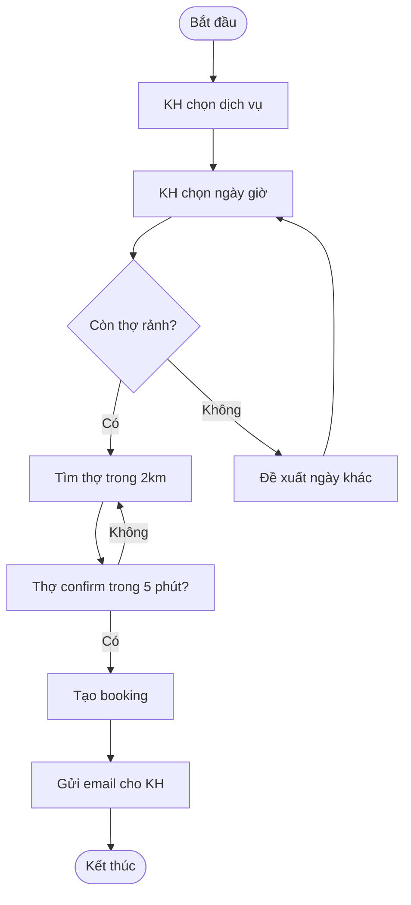

# TPL-011 — BPMN Cheat Sheet

**Buổi sử dụng:** B5 (Phân tích yêu cầu)
**Format gợi ý:** Markdown / In ra giấy mang đi workshop

## Mục đích
4 hình BPMN cốt lõi BA fresher cần thuộc — đủ để vẽ 90% sơ đồ quy trình.

## BPMN là gì?
**BPMN** = **B**usiness **P**rocess **M**odel and **N**otation = Sơ đồ quy trình nghiệp vụ chuẩn quốc tế.

Dùng BPMN để: vẽ quy trình → dev/khách/QA cùng hiểu một cách → giảm 80% hiểu nhầm.

---

## 4 hình cơ bản

### 1. Sự kiện (Event) — Vòng tròn

```
○         ◎         ●
Start     Intermediate   End
```

- **Start (vòng tròn rỗng):** Bắt đầu quy trình
- **Intermediate (vòng tròn dày):** Sự kiện giữa quy trình (timer, message, ...)
- **End (vòng tròn dày đậm):** Kết thúc quy trình

### 2. Công việc (Task) — Hình chữ nhật bo tròn

```
┌─────────────────┐
│  Tên công việc  │
└─────────────────┘
```

Quy ước: tên công việc dạng động từ + danh từ — vd. "Xác nhận đơn hàng", "Gửi email"

### 3. Cổng (Gateway) — Hình thoi (kim cương)

```
        ◇
       / \
      /   \
   YES     NO
```

- **Diamond rỗng:** OR exclusive (chỉ chọn 1 nhánh)
- **Diamond + dấu +:** Parallel (chạy đồng thời cả 2)
- **Diamond + dấu O:** Inclusive (có thể chạy 1 hoặc nhiều)

### 4. Luồng (Flow) — Mũi tên

```
A ──→ B    : Sequence flow (thường gặp nhất)
A ┄┄→ B    : Message flow (giao tiếp giữa lane)
A ─░─ B    : Association (liên kết với artifact)
```

---

## Lane / Pool — chia trách nhiệm theo vai trò

```
┌─────────────────────────────────────────┐
│ Pool: Hệ thống Đặt lịch sửa chữa        │
├──────────┬──────────────────────────────┤
│ Lane: KH │ ○ → [Chọn dịch vụ] → [...]   │
├──────────┼──────────────────────────────┤
│ Lane: Hệ │              [Match thợ] →   │
│  thống   │                              │
├──────────┼──────────────────────────────┤
│ Lane: Thợ│              ← [Confirm]     │
└──────────┴──────────────────────────────┘
```

- Mỗi vai trò = 1 Lane
- Tất cả Lane trong cùng Pool = 1 quy trình end-to-end

---

## Ví dụ: Đặt lịch sửa chữa điện lạnh — Mermaid syntax



→ Copy code trên paste vào [mermaid.live](https://mermaid.live) — sinh sơ đồ ngay.

---

## Quy tắc vẽ BPMN tốt

1. **Trái sang phải, hoặc trên xuống dưới** — không vẽ lung tung
2. **Mỗi flow = 1 happy path + các nhánh exception** — đừng nhồi tất cả vào 1 sơ đồ
3. **Đặt tên cụ thể** — "Process payment" thay vì "Step 5"
4. **Gateway luôn có label trên nhánh** — "Yes/No", "≥ 1tr / < 1tr"
5. **End event rõ ràng** — không để dangling arrow

---

## Tools recommended

| Tool | Free? | Khi nào dùng |
|------|------|---|
| **mermaid.live** | ✅ | Vẽ nhanh bằng text — share qua chat/Confluence |
| **draw.io / diagrams.net** | ✅ | Vẽ kéo-thả chuyên nghiệp |
| **BPMN.io** | ✅ | BPMN đúng chuẩn 2.0 (đẹp + standard) |
| **Lucidchart** | Pro | Team collaboration realtime |

## Tips

- **Bắt đầu bằng Mermaid** — sửa nhanh + version control trong Git
- **Dùng AI sinh khung** — mô tả text → AI sinh Mermaid → bạn edit (xem prompt B5)
- **In ra A3** mang đi workshop — stakeholder review trực tiếp trên giấy
- **Đừng over-engineer** — sơ đồ đơn giản mà đúng > sơ đồ complex mà không ai đọc
