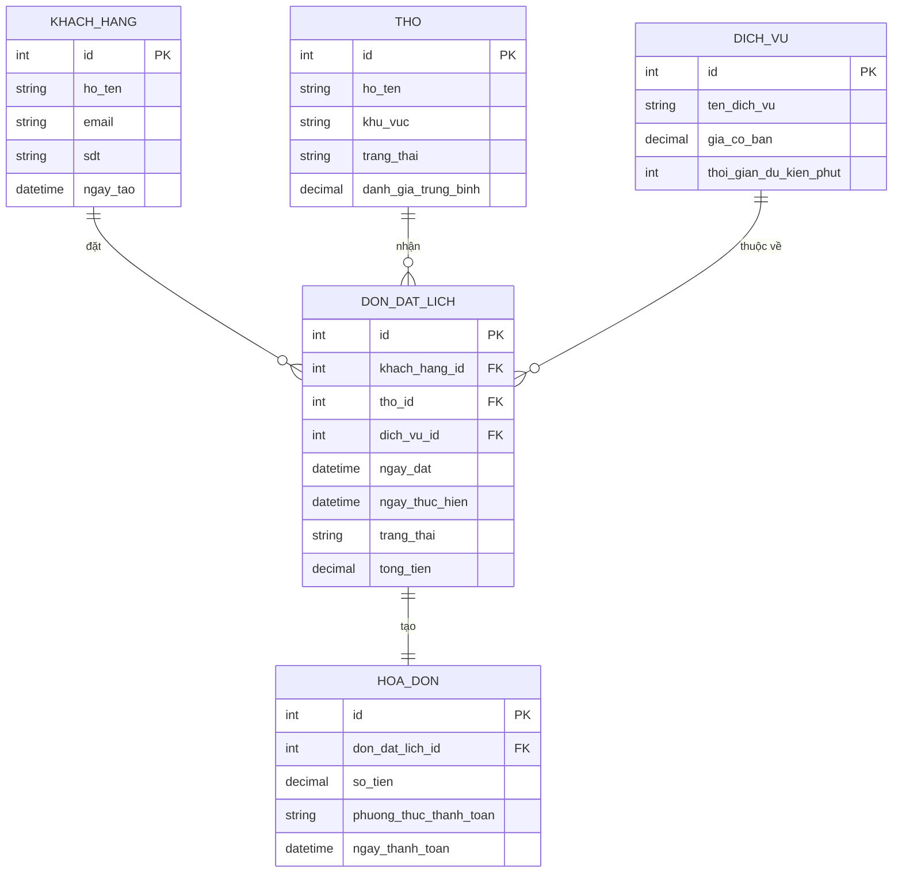
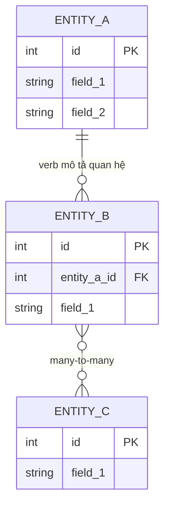

# TPL-012 — ERD Template + Cardinality Reference

**Buổi sử dụng:** B5 (Phân tích yêu cầu — phần dữ liệu)
**Format gợi ý:** Markdown + Mermaid / draw.io

## Mục đích
ERD = sơ đồ quan hệ thực thể — vẽ bằng tay hoặc bằng Mermaid để dev hiểu cấu trúc database.

## ERD là gì?
**ERD** = **E**ntity-**R**elationship **D**iagram = Sơ đồ thực thể-quan hệ.

Mục đích: vẽ ra **các bảng dữ liệu** + **mối quan hệ** giữa chúng → dev biết cách thiết kế DB.

---

## 3 thành phần cốt lõi

### 1. Entity (Thực thể) — bảng dữ liệu

```
┌─────────────────────┐
│      KhachHang      │
├─────────────────────┤
│ id (PK)             │
│ ho_ten              │
│ email               │
│ sdt                 │
│ ngay_tao            │
└─────────────────────┘
```

Quy ước: Entity name = danh từ, viết PascalCase hoặc snake_case.

### 2. Attribute (Thuộc tính) — cột trong bảng

| Loại | Ý nghĩa | Ký hiệu |
|------|---------|---------|
| PK (Primary Key) | Khoá chính, unique | gạch chân hoặc (PK) |
| FK (Foreign Key) | Khoá ngoại, link đến entity khác | (FK) |
| Required | Bắt buộc, NOT NULL | (*) hoặc bold |

### 3. Relationship (Quan hệ) — đường nối giữa entity

| Cardinality | Ký hiệu | Ý nghĩa | Ví dụ |
|---|---|---|---|
| **1 — 1** | `\|—\|` | 1-to-1 | 1 KH có 1 profile |
| **1 — N** | `\|—<` | 1-to-many | 1 KH có nhiều đơn hàng |
| **N — N** | `>—<` | many-to-many | 1 sinh viên học nhiều môn, 1 môn có nhiều sinh viên |
| **0..1** | `o—` | 0 hoặc 1 | 1 KH có thể có 0 hoặc 1 thẻ VIP |
| **0..N** | `o—<` | 0 hoặc nhiều | 1 sản phẩm có 0 hoặc nhiều review |

---

## Ví dụ: ERD cho hệ thống Đặt lịch sửa chữa

### Mermaid syntax



→ Paste vào [mermaid.live](https://mermaid.live) → sinh ERD ngay.

### Đọc ERD trên:
- 1 Khách hàng có thể đặt **nhiều** đơn (1—N)
- 1 Thợ có thể nhận **nhiều** đơn (1—N)
- 1 Đơn đặt lịch tạo ra **đúng 1** hoá đơn (1—1)
- 1 Dịch vụ có thể được đặt trong **nhiều** đơn (1—N)

---

## Template trống



---

## Quy tắc vẽ ERD tốt

1. **Entity name = danh từ số ít** — `KHACH_HANG` không phải `KHACH_HANGS`
2. **Mỗi entity ≥ 1 PK** — id auto-increment hoặc UUID
3. **N-N quan hệ → tạo bảng trung gian** — vd. SinhVien-MonHoc → tạo bảng `DangKyHoc`
4. **Đặt tên FK rõ** — `khach_hang_id` không phải `kh_id`
5. **Verb trên relationship line** — "đặt", "thuộc về", "tạo" — diễn đạt nghĩa quan hệ
6. **Không vẽ quá 15 entity / 1 sơ đồ** — chia nhỏ theo bounded context

---

## Tips

- **Bắt đầu bằng Mermaid** — version control trong Git, copy được
- **Dùng AI sinh khung** từ user story — xem prompt B5
- **Cardinality dễ sai:** 0..N vs 1..N khác nhau — hỏi khách "có bắt buộc có ≥ 1 không?"
- **Đừng over-normalize** — fresher hay split quá nhiều bảng → dev khổ
- **Show ERD cho khách non-tech bằng cách kể chuyện** — "1 khách hàng có thể đặt nhiều lịch, mỗi lịch chỉ giao cho 1 thợ" → khách hiểu ngay
